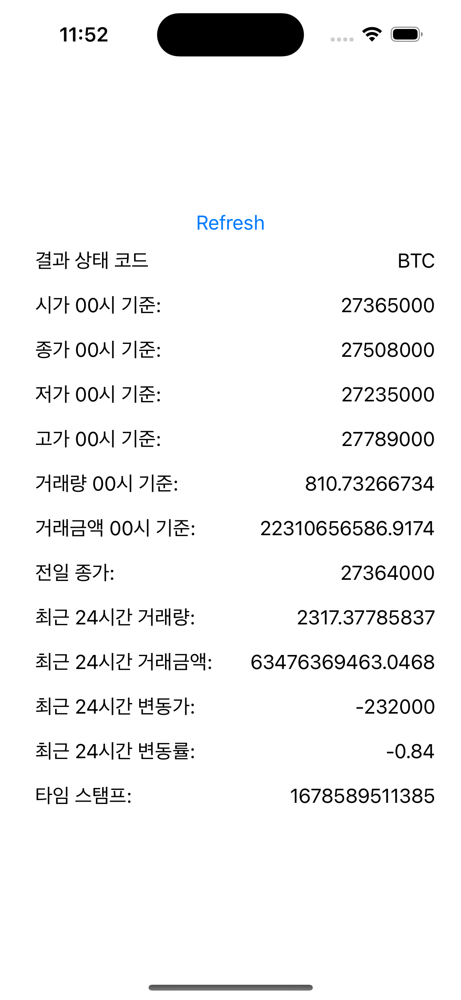

# BithumbAPIUsingMoya

## [Moya](https://github.com/Moya/Moya)

Alamofire를 기반으로 만들어진 ios opensource networking framework
Alamofire 위에 만들어지던 `API Manager` `Network Model`을 만드는데 있어서 좋다.

## Screenshot

